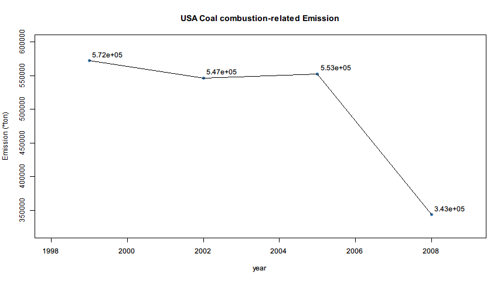
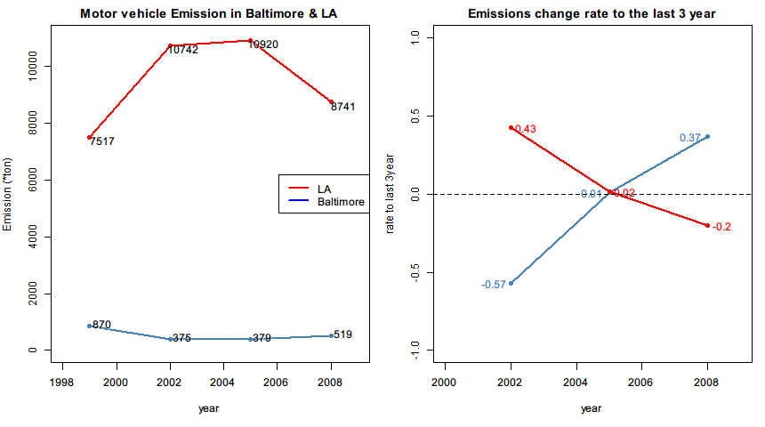

# 美国EPA国家空气污染物排放清单数据探索 #

> - 背景介绍
> - 数据说明
> - 数据探索

## 背景介绍 ##
细颗粒物(Fine Particulate matter)指环境空气中空气动力学当量直径小于等于 2.5 微米的颗粒物，简称PM2.5。它能较长时间悬浮于空气中，其在空气中含量浓度越高，就代表空气污染越严重。  
  
在美国，环境保护局(Environmental Protection Agency,简称EPA)的一项工作就有设定针对PM2.5的国家空气质量标准，并持续跟踪这类污染物的排放量。  
以下数据来自EPA发布的美国国家空气污染物排放清单(National Emissions Inventory,简称NEI)。更多信息了解EPA的[National Emissions Inventory](http://www.epa.gov/ttn/chief/eiinformation.html "NEI website")网页。

## 数据说明 ##
本次分析包含summarySCC_PM25.rds、Source_Classification_Code.rds两份数据。

`summarySCC_PM25.rds`  
包含了1999，2002，2005，2008年的PM2.5排放量数据。  
表格中含有一整年中来自特定排放源的PM2.5排放量数据，以吨计。  
**数据示例：**
<table cellspacing="0">
    <tr align="center">
        <td></td>
        <td>fips</td>
        <td>SCC</td>
        <td>Pollutant</td>
        <td>Emissions</td>
        <td>type</td>
        <td>year</td>
    </tr>
    <tr align="center">
        <td>4</td>
        <td>09001</td>
        <td>10100401</td>
        <td>PM25-PRI</td>
        <td>15.714</td>
        <td>POINT</td>
        <td>1999</td>
    </tr>
    <tr align="center">
        <td>8</td>
        <td>09001</td>
        <td>10100404</td>
        <td>PM25-PRI</td>
        <td>234.178</td>
        <td>POINT</td>
        <td>1999</td>
    </tr>
    <tr align="center">
        <td>12</td>
        <td>09001</td>
        <td>10100501</td>
        <td>PM25-PRI</td>
        <td>0.128</td>
        <td>POINT</td>
        <td>1999</td>
    </tr>
    <tr align="center">
        <td>16</td>
        <td>09001</td>
        <td>10100401</td>
        <td>PM25-PRI</td>
        <td>2.036</td>
        <td>POINT</td>
        <td>1999</td>
    </tr>
    <tr align="center"> 
        <td>20</td>
        <td>09001</td>
        <td>10100504</td>
        <td>PM25-PRI</td>
        <td>0.388</td>
        <td>POINT</td>
        <td>1999</td>
    </tr>
</table>

- fips: 5位数字表示的美国郡编号。以字符串存储。
- SCC: Source Classification Code, PM2.5排放源标识，以数字字符串标识。标识对应具体信息查看*Source_Classification_Code.rds*索引对照表。
- Pollutant: 污染物标识，字符串表示。
- Emissions: PM2.5排放量，以吨计。
- type: 排放源类型(分为point, non-point, on-road, non-road)
- year: 数据记录的年份

`Source_Classification_Code.rds`  
数据排放源索引对照表。  
每个字符串标识对应一种排放源。  
如“10100101”对应“Ext Comb /Electric Gen /Anthracite Coal /Pulverized Coal”

## 数据探索 ##
本次数据探索主要探索全美以及美国巴尔的摩市1999-2008年间的污染物排放量变化情况。  
**plot1-6.R分别对应生成plot1-6.png的代码**  

1.1999至2008年间，美国PM2.5的总排放量变化情况。  
  

2.1999至2008年间，Baltimore(巴尔的摩),Maryland郡(fips == "24510")的PM2.5总排放量变化情况。  
  
3.1999至2008年间，巴尔的摩市四种类型(point, nonpoint,onroad,nonroad)的排放源的排放量变化情况。  
  

4.1999至2008年间，全美来自煤炭燃烧相关的PM2.5排放量变化情况。  
  

5.1999至2008年间，巴尔的摩市机动车辆的污染物排放量变化情况。  
  

6.1999至2008年间，巴尔的摩市和洛杉矶市的机动车辆污染物排放量变化情况对比。  
  
